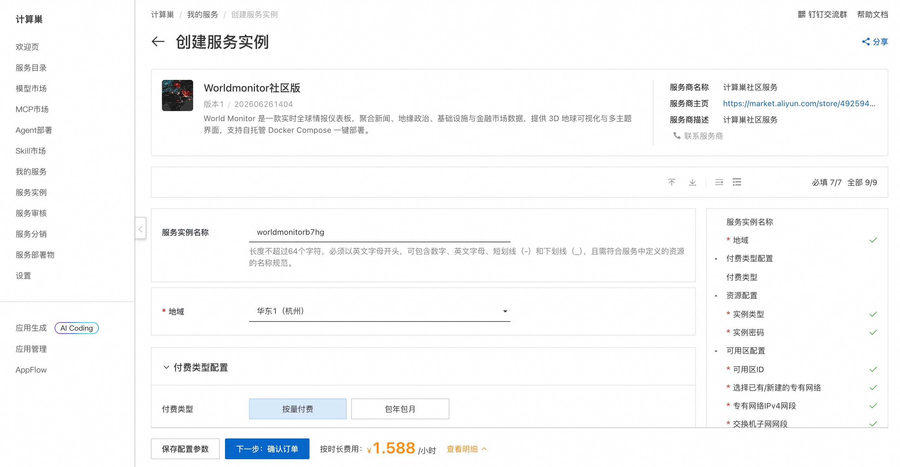
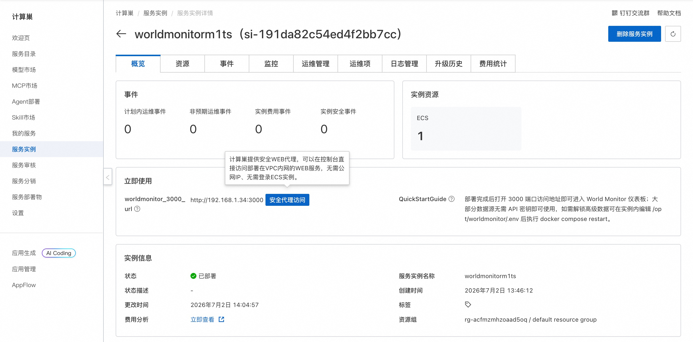
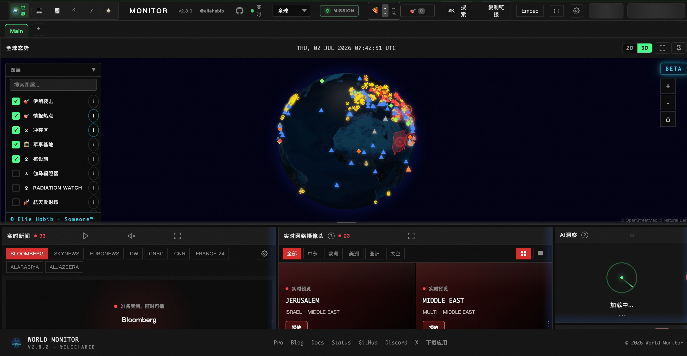

# Worldmonitor 社区版部署文档

## 概述

World Monitor 是一款实时全球情报仪表板，聚合新闻、地缘政治、基础设施与金融市场数据，提供 3D 地球可视化与多主题界面，支持自托管 Docker Compose 一键部署。通过阿里云计算巢服务，您可以快速部署 Worldmonitor 社区版，实现开箱即用。

## 部署流程

### 1. 创建服务实例

访问 Worldmonitor 社区版服务部署链接，按提示填写部署参数：

[部署链接](https://computenest.console.aliyun.com/service/instance/create/cn-hangzhou?type=user&ServiceId=service-68d695194f76444f949f)

### 2. 确认订单并创建

参数填写完成后可以看到对应询价明细，确认参数后点击 **下一步：确认订单**。确认订单完成后同意服务协议并点击 **立即创建** 进入部署阶段。

### 3. 等待部署完成

等待部署完成后进入服务实例管理，在控制台找到 Worldmonitor 社区版访问链接。

### 4. 访问服务

单击链接访问服务。

## 官方文档

更多信息请访问官方文档：[World Monitor GitHub 仓库](https://github.com/koala73/worldmonitor)
